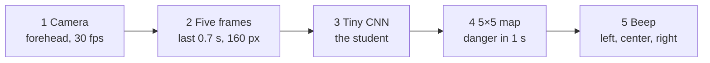
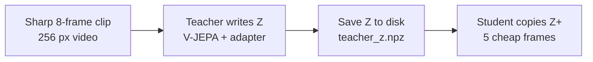
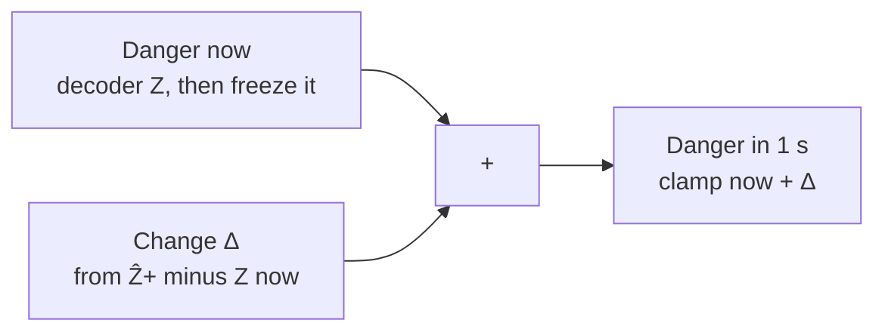

# How Collision V-JEPA works (plain language)

This is a walkthrough of **model_trial_2**: what the vest does, what the 5×5 map means, how the teacher and student are built, and where each piece lives in code.

The full technical contract (tensor shapes, YAML keys, invariants) is [`IMPLEMENTATION.md`](IMPLEMENTATION.md). How to run the scripts is in [`README.md`](README.md).

---

## The simple idea

The whole project is a **collision warning vest**. A camera on the walker’s forehead watches the road. The computer does not name “car” or “person”. It draws a tiny **5×5 danger map for one second in the future**, then beeps **left, center, or right**.

A huge video model (the **teacher**) is too big to wear. So we train it offline, save its notes, and teach a tiny network (the **student**) to copy those notes. **Only the student goes on the vest.**



That last step — five cheap frames in, danger map out — is this function:

```python
# cvjepa/models/student.py
def predict_future_heatmap(self, frames: torch.Tensor) -> torch.Tensor:
    return self.forward(frames)["h_plus_hat"]
```

---

## The 5×5 map, in plain words

Pretend the road in front of you is a tic-tac-toe board, but 5 by 5.

- **Top rows** = far away. Less important.
- **Bottom rows** = near your feet. If those light up, you are about to walk into trouble.
- **Left two columns** = left. **Middle column** = center. **Right two columns** = right.

Each cell is a number from 0 (empty / safe) to 1 (obstacle / “red”). The vest does not look at every cell equally. Near cells are multiplied by a bigger weight, then it takes the **max** in left / center / right.

```text
              LEFT    LEFT   CENTER   RIGHT   RIGHT
 far  ×0.50     ·       ·       ·       ·       ·
      ×0.65     ·       ·       ·       ·       ·
      ×0.80     ·       ·       ·       ·       ·
      ×1.00     ·       ·       ·       ·       ·
near  ×1.00     ·       ·       ·       ·       ·

SAFE < 0.42     CAUTION ≥ 0.42     STOP ≥ 0.70
```

Those column groups, row weights, and beep cutoffs live in the config and in `warning.py`:

```yaml
# configs/default.yaml
warning:
  row_weights: [0.5, 0.65, 0.8, 1.0, 1.0]
  left_cols: [0, 1]
  center_cols: [2]
  right_cols: [3, 4]
  caution_threshold: 0.42
  stop_threshold: 0.70
  confirm_frames: 3
  release_frames: 5
```

```python
# cvjepa/warning.py
def direction_scores(
    heatmap: np.ndarray,
    row_weights: list[float],
    left_cols: list[int],
    center_cols: list[int],
    right_cols: list[int],
) -> dict[str, float]:
    hm = np.asarray(heatmap, dtype=np.float32)
    w = np.asarray(row_weights, dtype=np.float32).reshape(-1, 1)
    weighted = hm * w
    groups = {"LEFT": left_cols, "CENTER": center_cols, "RIGHT": right_cols}
    scores: dict[str, float] = {}
    for name, cols in groups.items():
        scores[name] = float(weighted[:, cols].max()) if cols else 0.0
    return scores


def severity_from_score(score: float, caution_threshold: float, stop_threshold: float) -> int:
    if score >= stop_threshold:
        return STOP
    if score >= caution_threshold:
        return CAUTION
    return SAFE
```

So:

- winning score **below 0.42** → SAFE (stay quiet)
- **0.42 to 0.70** → CAUTION (a beep; counts as nuisance if the road was actually empty)
- **0.70 and up** → STOP (must beep; staying silent is a miss)

To avoid a single noisy frame buzzing the vest, `HitLatch` waits for **3 danger frames in a row** to turn on, and **5 safe frames in a row** to turn off.

```python
# cvjepa/warning.py  — HitLatch.update
def update(self, raw_severity: int, raw_direction: str) -> tuple[str, int]:
    if raw_severity >= CAUTION:
        self._danger_streak += 1
        self._safe_streak = 0
        ...
    if not self.active:
        if self._danger_streak >= self.confirm_frames:
            self.active = True
            ...
    else:
        if self._safe_streak >= self.release_frames:
            self.active = False
```

---

## Two networks, because one is huge and one must be tiny

Think of homework:

1. An **expert** (V-JEPA 2 Giant) already watched millions of real videos, so it “understands motion”.
2. We show it *our* walking videos and teach it to fill in the 5×5 danger sheet.
3. While it works, it writes **notes** called `Z`: 32 numbers in each of the 25 cells. Those notes are not the beep. They are a compact “what is going on here?” description that can be turned into the beep.
4. A **small intern** (TinyCNN, about 2 million weights) never sees the Giant at wear time. It only learns: “from 5 small pictures, write the same notes the expert would write.”



The future map is not drawn from scratch. The model **copies danger-now, then adds a learned change**:



---

## What one moment looks like

Videos are 150 frames at 30 fps (5 seconds). At time \(t\), we want the map at \(t+30\) (exactly 1 second later).

**Teacher input** — 8 sharp 256 px frames, every other frame, ending at \(t\):

```python
# cvjepa/data/dataset.py
def teacher_clip_indices(t_end: int, clip_frames: int, stride: int) -> list[int]:
    start = t_end - (clip_frames - 1) * stride
    return [start + i * stride for i in range(clip_frames)]
```

With 8 frames and stride 2 that is `[t-14, t-12, …, t]`.

**Student input** — 5 cheaper 160 px frames:

```yaml
# configs/default.yaml  — student.frame_offsets
frame_offsets: [-20, -15, -10, -5, 0]
```

That is “now, and four looks back over the last ~0.7 s”. The dataset stacks those frames and also loads the teacher notes for now and for 1 s later:

```python
# cvjepa/data/dataset.py  — StudentDataset.__getitem__
now_ids = [t + off for off in self.frame_offsets]
clip = np.stack([frames_arr[fid] for fid in now_ids], axis=0)
h_now = np.array(heatmaps_arr[t], dtype=np.float32)
h_future = np.array(heatmaps_arr[t + self.tau_frames], dtype=np.float32)
...
if z_end is not None:
    item["z_t"] = torch.from_numpy(np.array(z_end[t], dtype=np.float32))
    item["z_plus"] = torch.from_numpy(np.array(z_end[t + self.tau_frames], dtype=np.float32))
```

`tau_frames` is 30, so `z_plus` is “the teacher’s notes when the future clip arrives.”

---

## Teacher pieces, simply

### 1. The Giant (V-JEPA 2)

Frozen video brain. It turns the 8-frame clip into a long list of tokens (little descriptions of space and time). We do not train its main weights. That would smash the useful motion knowledge on only a few hundred sim episodes.

```python
# cvjepa/models/teacher.py
def encode(self, clip: torch.Tensor) -> torch.Tensor:
    tokens = self.backbone(clip)
    return self.adapter(tokens, self.backbone.spatial)
```

### 2. The adapter

Tokens are a 16×16 picture of 1408-d features (Giant `hidden_size`). The adapter **averages over time**, mixes neighbors with a 3×3 conv, pools down to 5×5, and shrinks each cell to 32 numbers. That 5×5 is now the same shape as the danger map.

```python
# cvjepa/models/teacher.py  — SpatialAdapter.forward
def forward(self, tokens: torch.Tensor, spatial: int) -> torch.Tensor:
    ...
    grid = tokens.reshape(b, t_prime, spatial, spatial, c)
    grid = grid.mean(dim=1).permute(0, 3, 1, 2).contiguous()
    x = self.reduce(grid)
    x = F.adaptive_avg_pool2d(x, self.feature_grid)
    z = self.bottleneck(x)
    ...
    return z.permute(0, 3, 1, 2).contiguous()
```

### 3. Three small heads on top of Z

- **Decoder:** notes → “how dangerous is it *right now*?”
- **Predictor P:** notes now → notes a bit into the future (\(\hat Z_+\))
- **Delta:** “how should the map *change* in 1 s?”

```python
# cvjepa/models/teacher.py
def _heads(self, z_t: torch.Tensor) -> dict:
    z_plus_hat = self.predictor(z_t)
    h_now = self.decoder(z_t)
    delta = self.delta_head(z_plus_hat - z_t)
    h_plus = (h_now.detach() + delta).clamp(0.0, 1.0)
    return {
        "z_t": z_t,
        "z_plus_hat": z_plus_hat,
        "h_now_hat": h_now,
        "h_plus_hat": h_plus,
        "delta": delta,
    }
```

The important trick: **`h_now.detach()`**. Today’s map is copied, then frozen so gradients cannot sneak back through it. The network is forced to learn the *change*, not redraw the whole map from scratch. (Copying “danger now = danger in 1 s” is already a pretty good cheat on slow scenes. We do not want the model to live on that cheat.)

Decoder uses sigmoid (0 to 1). Delta uses tanh (−1 to 1), so it can raise *or* lower a cell:

```python
# cvjepa/models/decoder.py
class HeatmapDecoder(nn.Module):
    def forward(self, z: torch.Tensor) -> torch.Tensor:
        return torch.sigmoid(self.net(z)).squeeze(1)

class HeatmapDelta(nn.Module):
    def forward(self, z: torch.Tensor) -> torch.Tensor:
        return torch.tanh(self.net(z)).squeeze(1)
```

### LoRA, simply

In phase 2 we still do not unfreeze the Giant. We add a tiny side path \(BAx\) next to each Linear in the last 6 blocks. At the start \(B\) is all zeros, so the Giant behaves exactly as before. Training only nudges it a little toward “collision” instead of generic video.

```python
# cvjepa/models/lora.py
def forward(self, x: torch.Tensor) -> torch.Tensor:
    base = self.linear(x)
    x_lora = x.to(dtype=self.lora_A.dtype)
    delta = F.linear(F.linear(x_lora, self.lora_A), self.lora_B) * self.scale
    return base + delta.to(dtype=base.dtype)
```

---

## Student pieces, simply

The student never loads V-JEPA.

**TinyCNN** looks at each of the 5 frames alone and shrinks it to a 5×5 × 128 feature map.

```python
# cvjepa/models/tiny_cnn.py
def forward(self, x: torch.Tensor) -> torch.Tensor:
    x = self.stem(x)
    x = self.block1(x)
    x = self.block2(x)
    x = self.block3(x)
    x = self.block4(x)
    return self._pool_to_grid(x)
```

Then it does something very intuitive: **keep “now”, and also keep how now differs from each older frame.** Growing blobs in those diffs are looming (things getting bigger because they are coming at you). Four extra **loom** channels are hand-made from brightness, not learned:

```python
# cvjepa/models/student.py
def pixel_loom(frames: torch.Tensor, grid: int) -> torch.Tensor:
    ...
    avg_n = avg[:, -1]
    mx_n = mx[:, -1]
    return torch.cat([avg_n, avg_n - avg[:, 0], mx_n - mx[:, 0], mx_n - avg_n], dim=1)
```

```python
# cvjepa/models/student.py  — ContextEncoder.forward
def forward(self, frames: torch.Tensor) -> torch.Tensor:
    ...
    now = feats[:, -1]
    parts = [now]
    for i in range(n - 1):
        parts.append(now - feats[:, i])
    x = torch.cat(parts, dim=1)
    if self.use_loom:
        x = torch.cat([x, pixel_loom(frames, self.feature_grid)], dim=1)
    return self.encoder(x)
```

644 channels in (5×128 features + 4 loom) → 32-d `Z` on the 5×5 grid. Same shape as the teacher.

Then the student uses **the teacher’s decoder and delta, frozen**. If those stayed trainable, a messy student `Z` could still look like a pretty heatmap. Frozen heads force the intern to write notes in the expert’s handwriting.

```python
# cvjepa/models/student.py
def load_frozen_heads(self, teacher_state: dict) -> None:
    dec = {k[len("decoder.") :]: v for k, v in teacher_state.items() if k.startswith("decoder.")}
    self.decoder.load_state_dict(dec)
    for p in self.decoder.parameters():
        p.requires_grad_(False)
    ...
            for p in self.delta_head.parameters():
                p.requires_grad_(False)
```

That load happens at the start of student training:

```python
# scripts/04_train_student.py
teacher_ckpt = Path(cfg.get("paths.ckpt_dir")) / "teacher_best.pt"
if teacher_ckpt.exists():
    tstate = torch.load(teacher_ckpt, map_location="cpu", weights_only=False)["model"]
    model.load_frozen_heads(tstate)
```

---

## How training actually runs (three stages)

**Prepare.** Decode each episode’s `preview.mp4` into `frames_160.npy`, `frames_256.npy`, and `heatmaps.npy`. Split by **episode**, never by frame, so the test walk is a walk the net has never seen.

### Stage A — train the teacher (`scripts/02_train_teacher.py`)

- Phase 1: freeze the Giant. Train only adapter + decoder + predictor. “Can we even read a danger map out of V-JEPA tokens?”
- Phase 2: add LoRA on the last 6 blocks. “Nudge the tokens a little so they become collision-shaped.”

Teacher loss: paint the future map, paint the now map, get left/center/right right, **don’t paint empty road red**, and make Δ match the true change.

```python
# scripts/02_train_teacher.py  — teacher_loss
l_h = weighted_focal_mse(
    out["h_plus_hat"], h_fut, focal_w, gamma, change, change_w, fn_w, cell_weights=spatial_w
)
...
l_fp = false_positive_penalty(...)
...
loss = (
    l_h
    + float(cfg.get("jepa.now_weight", 0.35)) * l_now
    + float(cfg.get("jepa.dir_weight", 0.30)) * l_dir
    + float(cfg.get("jepa.fp_weight", 0.45)) * l_fp
    + float(cfg.get("jepa.delta_weight", 0.50)) * l_delta
)
```

In everyday language, those terms mean:

| Loss | What we nag the model about |
|---|---|
| \(L_H\) | The 1 s map should match the label, especially hot cells and cells that are *changing* |
| \(L_{\mathrm{now}}\) | Right now should also look right |
| \(L_{\mathrm{dir}}\) | Left / center / right should match |
| \(L_{\mathrm{FP}}\) | Empty walking lane must stay dark (anti-false-alarm) |
| \(L_{\Delta}\) | The change head should match “future minus now” |

False-positive penalty, the “don’t cry wolf” term:

```python
# cvjepa/losses.py
def false_positive_penalty(...):
    safe = (target < safe_threshold).float()
    ...
        col_w[center_cols.long()] = float(center_mult)
    return (pred.clamp(min=0.0).pow(2) * weight).mean()
```

On cells that are truly empty (\(H < 0.25\)), any predicted redness is squared and punished, extra hard in the center columns `[1, 2, 3]`.

### Stage B — save the notes (`scripts/03_cache_teacher_z.py`)

Run the trained teacher on every frame of every episode. Write `teacher_z.npz`. The student will only read this file. The Giant does not sit in the student training loop (it would not fit).

```python
# scripts/03_cache_teacher_z.py
frames = np.load(cache_dir / ep / f"frames_{size}.npy", mmap_mode="r")
z_end = np.zeros((n_frames, zc, grid, grid), dtype=np.float32)
mask = np.zeros((n_frames,), dtype=bool)
ends = list(range(e_lo, min(n_frames, len(frames))))
```

If you change LoRA or the adapter after a cache, re-run Stage B. Stale `Z` silently poisons Stage C.

### Stage C — train the student (`scripts/04_train_student.py`)

Same heatmap losses, plus one extra: **make your predicted future notes \(\hat Z_+\) look like the teacher’s saved notes at \(t+30\)**. That is the JEPA / distillation term.

```python
# scripts/04_train_student.py
l_j = out["z_plus_hat"].new_zeros(())
if lam > 0 and "z_plus" in batch:
    l_j = jepa_distance(out["z_plus_hat"], batch["z_plus"])
...
loss = (
    l_h
    + ... * l_now
    + ... * l_mid
    + ... * l_dir
    + ... * l_fp
    + lam * l_j
    + ... * l_delta
)
```

```python
# cvjepa/losses.py
def jepa_distance(z_hat: torch.Tensor, z: torch.Tensor, cos_weight: float = 1.0) -> torch.Tensor:
    """Match student Zhat+ to teacher Z. Scale by teacher std so heatmap loss is not drowned."""
    scale = z.detach().flatten(1).std(dim=1, keepdim=True).clamp_min(1e-3)
    ...
    mse = F.mse_loss(z_hat.float() / scale, z.float() / scale)
    cos = F.cosine_similarity(z_hat.float(), z.float(), dim=1)
    return mse + cos_weight * (1.0 - cos).mean()
```

`z` is detached (stop-grad). The teacher’s notes are a **fixed target**, not something the student can push around. We also divide by the teacher’s spread so a large `Z` does not drown the heatmap losses.

We also show the student a half-way map at 0.5 s (`h_mid`, 15 frames) so change is learned smoothly, not only at the 1 s mark.

---

## What is actually being learned?

Not “recognize a cyclist.” Not “rebuild the pixels.” Three things:

1. **Teacher adapter / LoRA:** “In this Giant video language, which patterns mean *about to hit the walker* vs *empty road*?”
2. **Copy-residual Δ:** “Given notes now, how will the 5×5 *move* in the next second?”
3. **Student CNN:** “From 5 cheap frames and looming diffs, write the same notes the teacher would write when the future arrives.”

After that, the frozen decoder is just a translator: notes → map → beep.

---

## How we pick a “good” checkpoint

We do **not** pick the lowest pixel error. A map that paints the empty corridor red can have okay MSE and still be a terrible vest.

```python
# cvjepa/metrics.py
class WearableAccumulator:
    """Latched beep errors: nuisance = P(beep|SAFE), miss = P(silent|STOP)."""
```

- **Miss** = it stayed quiet while the true label was STOP (you walk into something).
- **Nuisance** = it beeped while the true label was SAFE (you stop trusting it).

A checkpoint is even allowed to compete only if nuisance ≤ 0.20 **and** miss ≤ 0.25. Eligible always beats ineligible:

```python
# cvjepa/engine.py
def wearable_better(cur: dict, best: dict | None) -> bool:
    if best is None:
        return True
    c_el, b_el = bool(cur.get("eligible")), bool(best.get("eligible"))
    if c_el != b_el:
        return c_el
    return float(cur["score"]) > float(best["score"])
```

---

## The path on the vest, one more time

Camera → 5 frames at 160 px → TinyCNN + loom diffs → `Z` → student’s predictor → frozen teacher Δ added onto a frozen “danger now” → 5×5 map 1 s ahead → left / center / right + SAFE / CAUTION / STOP, with a 3-frame latch.

No Giant. No cache file. No shuffle. That is `CollisionStudent.predict_future_heatmap`.

---

## Where to look next

| Question | File |
|---|---|
| V-JEPA load, adapter, copy-residual heads | `cvjepa/models/teacher.py` |
| LoRA wrap | `cvjepa/models/lora.py` |
| TinyCNN, loom, frozen decoder copy | `cvjepa/models/student.py` |
| Heatmap decoder and Δ | `cvjepa/models/decoder.py` |
| Losses (focal MSE, FP, JEPA) | `cvjepa/losses.py` |
| LEFT / CENTER / RIGHT + latch | `cvjepa/warning.py` |
| Nuisance / miss | `cvjepa/metrics.py` |
| Teacher clips and student `Z` cache reads | `cvjepa/data/dataset.py` |
| Stage A loop | `scripts/02_train_teacher.py` |
| Stage B cache | `scripts/03_cache_teacher_z.py` |
| Stage C loop | `scripts/04_train_student.py` |
| Current recipe | `configs/default.yaml` |
| Tensor-level spec | [`IMPLEMENTATION.md`](IMPLEMENTATION.md) |
